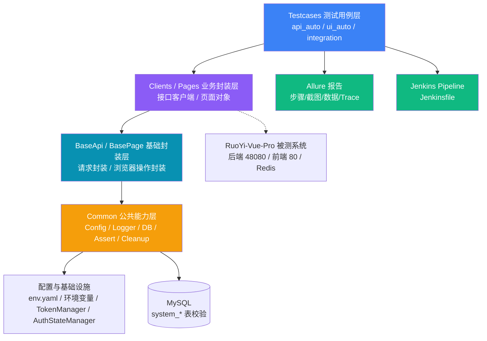

# RuoYi-Vue-Pro 后台管理系统接口与 UI 自动化测试项目

> 基于本地 **RuoYi-Vue-Pro / yudao** 后台管理系统，使用 Python + pytest + requests + Playwright 搭建综合自动化测试项目。
>
> 当前真实环境：后端 `http://localhost:48080`（管理端统一前缀 `/admin-api`），前端 `http://localhost:80`，数据库 `ruoyi-vue-pro`。
>
> 设计/实现 **205 个测试实例**（193 条业务用例 + 12 条框架单测），已在当前环境分层验证全部通过。

## 技术栈
Python · pytest · requests · Playwright · Page Object · YAML · pymysql · Allure · Jenkins · Git · JMeter

## 项目亮点
1. **接口与 UI 分层覆盖**：接口验证业务逻辑和数据，UI 验证真实页面操作。
2. **数据库校验**：验证数据真实落库、状态变化和逻辑删除。
3. **稳定请求与 Token 管理**：GET/HEAD/OPTIONS 遇到瞬时错误时由 urllib3 自动重试2次；共享 `TokenManager` 支持过期刷新和401恢复。
4. **UI 登录态复用**：`LoginPage` + `AuthStateManager` 统一生成 `storage_state`，失效时自动重新登录。
5. **环境自清理**：关系表优先清理，主表按本轮唯一前缀兜底；API/UI 签发的 Token 精确登记并在 session 结束时注销。
6. **Page Object 分层**：页面元素与业务动作封装，UI 测试用例不直接操作裸 `page/locator`。
7. **权限场景设计**：角色菜单、用户角色关系通过接口和 `system_*` 数据库表双重验证。
8. **失败定位**：失败截图 + Playwright Trace 回放；成功用例不保存 Trace，避免报告膨胀。
9. **工程化**：环境变量配置、日志/Allure 脱敏、pytest markers、Jenkinsfile 报告归档设计。
10. **性能补充**：已编写 JMeter 登录取 `data.accessToken` + 字典类型分页压测方案和 `.jmx` 测试计划；未提交真实压测结果。

## 当前环境

| 项 | 值 |
|---|---|
| 被测系统 | RuoYi-Vue-Pro / yudao |
| 后端 | `http://localhost:48080` |
| API 前缀 | `/admin-api` |
| 前端 | `http://localhost:80`，Vue3 + Element Plus + Vite |
| 登录接口 | `POST /admin-api/system/auth/login` |
| 成功业务码 | `code == 0` |
| Token 字段 | `data.accessToken` |
| Header | `tenant-id: 1`，`Authorization: Bearer <accessToken>` |
| MySQL | Docker / 本机 `3306` / 库 `ruoyi-vue-pro` |
| Redis | Docker / 本机 `6379` |
| 默认账号 | `admin / admin123` |

## 项目目录
```text
ruoyi-auto-test/
├── common/            公共工具（配置/日志/DB/断言/脱敏/清理）
├── api_auto/          接口自动化（base/clients/testcases）
├── ui_auto/           UI 自动化（base/pages/testcases）
├── integration/       接口联动与数据库校验用例
├── data/              env.example.yaml + 测试数据
├── docs/              测试计划/用例设计/缺陷报告/总结/面试稿/JMeter文档
├── jmeter/            JMeter .jmx 测试计划
├── reports/           Allure 报告
├── screenshots/       失败截图
├── traces/            Playwright Trace 文件
├── logs/              日志
├── pytest.ini  requirements.txt  Jenkinsfile  conftest.py
```

## 项目架构图



**分层职责：**
- **Testcases 用例层**：只表达测试逻辑（准备-执行-断言-清理），不直接调底层 API
- **Clients/Pages 封装层**：把业务动作封装成方法（如 `user_client.create()`、`dept_page.search()`）
- **Base 基础层**：统一处理请求头/Token 注入、浏览器等待/截图等通用机制
- **Common 公共层**：配置读取、日志脱敏、DB 查询、断言工具、数据清理

## 自动化范围
- **API 接口**：103 条（10 模块：登录/部门/字典/菜单/岗位/角色/用户/日志/个人中心/通知公告）
- **UI 自动化**：70 条（含 9 条 REAL 真实 UI 操作用例）
- **接口联动 / DB 校验**：20 条
- **框架单测**：12 条（BaseApi HTTP 客户端 + common 工具）
- **合计**：**205** 条测试实例

## 配置方式（推荐环境变量）
```bash
set BASE_URL=http://localhost:48080
set WEB_URL=http://localhost:80
set TENANT_ID=1
set TENANT_NAME=芋道源码
set ADMIN_USERNAME=admin
set ADMIN_PASSWORD=admin123
set DB_HOST=127.0.0.1
set DB_PORT=3306
set DB_USER=root
set DB_PASSWORD=123456
set DB_NAME=ruoyi-vue-pro
```

也可复制 `data/env.example.yaml` 为本地 `data/env.yaml`；`data/env.yaml` 已加入 `.gitignore`，不要提交真实密码。

## 运行方式
```bash
pip install -r requirements.txt
playwright install

# 确认后端 48080、前端 80、MySQL、Redis 已启动，测试环境验证码关闭
pytest api_auto/testcases          # 只跑接口
pytest ui_auto/testcases           # 只跑 UI
pytest integration                 # 只跑联动
pytest                             # 全量
allure serve reports/allure-results
```

Windows 本地完整启动顺序：

```powershell
cd E:\ruoyi\script\docker
docker compose up -d mysql redis

cd E:\ruoyi
java -jar yudao-server\target\yudao-server.jar --spring.profiles.active=local

cd E:\ruoyi\yudao-ui\yudao-admin-vue3
npm run dev

cd E:\ruoyi\test\ruoyi-auto-test
pytest -v
```

初次阅读项目请先看：`docs/初学者代码导读.md`。

## JMeter 性能测试
文档：`docs/JMeter性能测试操作文档.md`  
测试计划：`jmeter/ruoyi_login_dict_perf.jmx`

说明：当前已提供可导入 JMeter 的测试计划和操作步骤，但**未产出真实性能报告**，简历应写“编写/设计 JMeter 性能测试方案”，不要写“完成性能测试并达标”。

## 面试说明
- 面试稿：`docs/面试讲解稿.md`
- 测试计划：`docs/测试计划.md`
- 测试用例设计方法：`docs/测试用例设计方法.md`
- 缺陷报告：`docs/缺陷报告.md`
- 测试总结：`docs/测试总结.md`
- 基础能力学习清单：`docs/基础能力学习清单.md`
